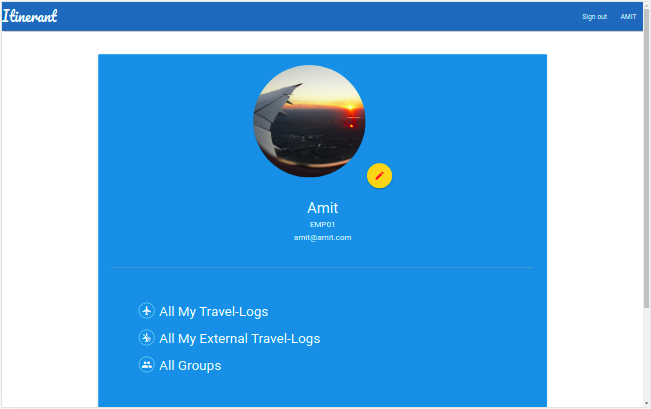
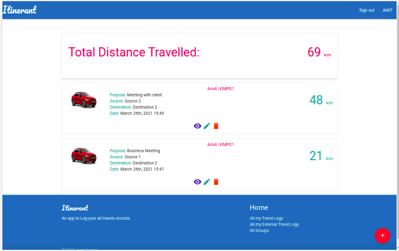
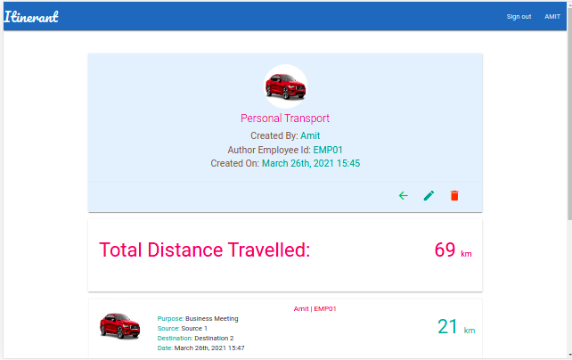

### Rails Capstone Project

# Itinerant


Itinerant is a web App that allows user to keep the record of all his travel logs.

It can be used by any organisations who wants their employee to keep track of all their travels in order to provide Travel Allowances (TA).
An employee can group his travel in different categories and also create a custom category to categorize his travel record.

It's extremely easy for an organisation to monitor all the travel records of their employees on daily basis and estimate the allowances and analyse on 
different basis e.g. department wise, month wise or the travel made by using private or public transportation.







## Features

* A successful logged in user can visit to his profile page where he can edit his credentials and can upload/update his profile image
* On the profile page a user can see link to 'All My Travel-Logs' where a new travel log can be created or user can view all the travel history, the most recent at the top.
    * A user can also see the total distance travelled by him at the top
    * A user can edit his log and delete the old ones
* On the profile page a user can see link to 'All My External Travel-Logs', which shows the logs not assigned to any group.
    * A user can see the total distance travelled which are not grouped at the top.
    * A user can view, edit or delete logs from this page
* On the profile page a user can find link to 'All Groups' page which shows list of all the groups.
    * It lists all the groups along with the Author of corresponding group.
    * A user can create a new group or edit and delete it.
    
## Presentation

[Watch Video Presentation]()

## Live Demo Link

[View Live on Heroku](https://glacial-hamlet-02969.herokuapp.com/)


## Built With 🛠

```
- Ruby: 2.7.2
- Ruby on Rails: 6.1.3
- Postgresql
- Materialize
```

## Install ⏳

> Follow below steps to Run it on your local machine

1. - [ ] Open your `Terminal`
2. - [ ] Navigate to the directory where you will like to install the repo by running `cd FOLDER-NAME`
3. - [ ] Run `git@github.com:KumarAmitt/travel-log.git` to download <b>or</b> you can download using `HTTPS` by running `https://github.com/KumarAmitt/travel-log.git` in the terminal
4. - [ ] Run `cd travel-log` to enter directory
5. - [ ] Run `bundle install` to install Ruby Gems.
6. - [ ] Run `rails db:create` to create your database
7. - [ ] Run `rails db:migrate` to migrate your database
8. - [ ] Run `rails s` to get the server running
9. - [ ] Enter `http://localhost:3000/` in the browser to get the app running

## Testing

In order to run the tests, RSPEC should be installed.

- Please run the following command line in your terminal to install :

```bash
gem install rspec
```

- When the installation is complete, type this command inside `travel-log` folder to run the tests :

```bash
rspec
```

## Author

### 👨‍💻 Amit Kumar

- GitHub: [@KumarAmitt](https://github.com/KumarAmitt)
- Twitter: [@ArrshAmit](https://twitter.com/ArrshAmitt)
- LinkedIn: [@kumar-amitt](https://www.linkedin.com/in/kumar-amitt)

### 🤝 Contributing

Contributions, issues and feature requests are welcome!

- Fork the project
- Create your feature branch `git checkout -b feature`
- Commit your changes `git commit -m 'feature'`
- Push it `git push -u origin feature`
- Open a pull request using this branch


Feel free to check the [issues page](https://github.com/KumarAmitt/travel-log/issues).


## Acknowledgments

- Hat tip to anyone whose code was used
- Interface design and the App Idea by [Gregoire Vella](https://www.behance.net/gregoirevella) and [Behance.net](https://www.behance.net/gallery/19759151/Snapscan-iOs-design-and-branding?tracking_source=)

### Show your support

Give a ⭐️ if you like this project!

### License

&copy; 2020 Amit Kumar

Permission is hereby granted, free of charge, to any person obtaining a copy
of this software and associated documentation files (the "Software"), to deal
in the Software without restriction, including without limitation the rights
to use, copy, modify, merge, publish, distribute, sublicense, and/or sell
copies of the Software, and to permit persons to whom the Software is
furnished to do so, subject to the following conditions:

The above copyright notice and this permission notice shall be included in all
copies or substantial portions of the Software.

THE SOFTWARE IS PROVIDED "AS IS", WITHOUT WARRANTY OF ANY KIND, EXPRESS OR
IMPLIED, INCLUDING BUT NOT LIMITED TO THE WARRANTIES OF MERCHANTABILITY,
FITNESS FOR A PARTICULAR PURPOSE AND NONINFRINGEMENT. IN NO EVENT SHALL THE
AUTHORS OR COPYRIGHT HOLDERS BE LIABLE FOR ANY CLAIM, DAMAGES OR OTHER
LIABILITY, WHETHER IN AN ACTION OF CONTRACT, TORT OR OTHERWISE, ARISING FROM,
OUT OF OR IN CONNECTION WITH THE SOFTWARE.
